<link href="style.css" rel="stylesheet"></link>

# _Ripley, 2014 - 2019_

_**Dear reader:** I may be about to make you cry. 
I mean, you don't have to if you don't want to, it's fine. I won't judge you if you don't. We're crying, though, so you'll be in good company. Come on in, pull up a stack of tissues. 
At any rate, what follows is going to be absurdly sentimental, and I solemnly promise to leave no tear-jerking stone unturned. You've been warned ❤️_

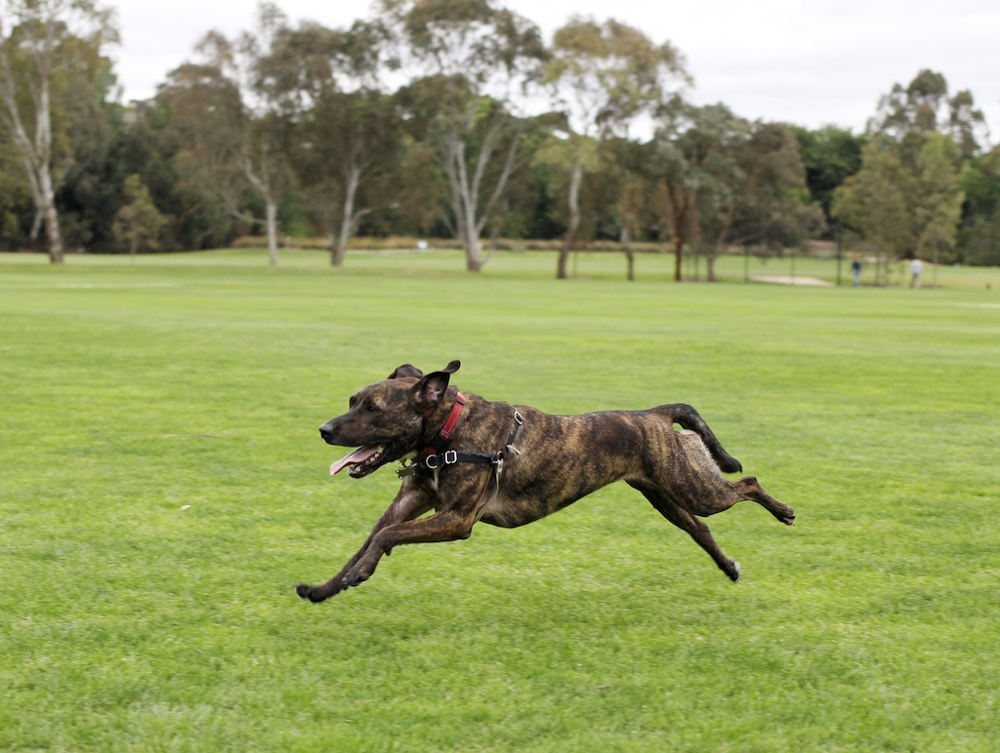

Ripley leapt into our lives one morning at a dog rescue foster house in Seddon. We opened their front gate, and found ourselves in a surprise full-body embrace with a hyper-kinetic, lick-happy bundle of awkward brindle affection. Things might've gone differently for more seasoned dog-choosers, at that point. They probably would've made certain keen observations about energy levels, excitability, and probable nervousness; given her an affectionate pat or two while making smalltalk with the foster-carers, and been on their way with a non-commital "we'll think it over." We, on the other hand, were immediately lost, and I'm so very glad that we were.

Things didn't get off to a great start. We took her for a trial walk around the neighbourhood. Ripley walked like the "before" footage from an episode of "The Dog Whisperer". She pulled until she nearly choked herself out, had her own itinerary that only fleetingly overlapped with ours, and she paid so little attention to verbal commands that I started to find the the carer's assurance that she'd had "some training" a _little bit questionable._

We took her home for a trial period, and during the 5 minute walk back from the car-share, Ripley had had her first minor anxiety attack (trains) and caused the first of many Ripley-inspired arguments (over the correct way to introduce her to the house).
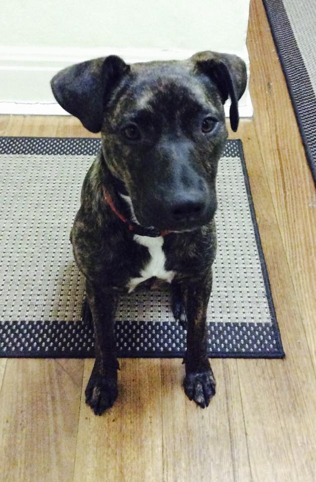

She frightened my parents' new whippet puppy, harried and annoyed their senior greyhound, and prompted plenty of wry observations from my sister about her sanity and what exactly we were in for. Kim has a good line in wry observations.

"Hyper-kinetic" was the right term for Ripley in her prime. She had the atheleticism and muscle to sprint or launch herself into the air at awe-inspiring speed, the endurance to do that for hours on end, and a worrying lack of body awareness that made her skull a serious hazard to the kneecaps of anyone present while she was at it (dear macho-looking-guy-in-the-dog-park-that-one-time: I'm still really sorry and I hope your knee healed okay). 

We once took her on a camping trip with a friend of mine, and watched in bemusement as she repeatedly sprinted a hundred meters to scout ahead, and then back to us; all the way up a mountain. "She's going to be so tired soon" my friend commented. She was not.
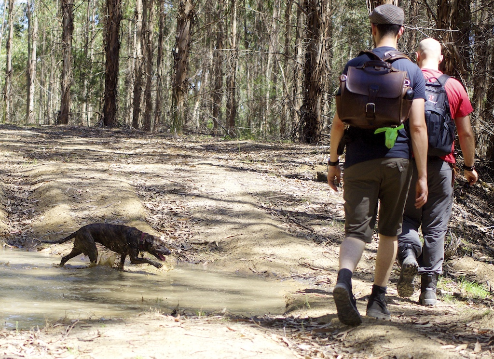

Thankfully, all the crazy energy came bundled with an incredibly sweet temperament, and an impressive intelligence. Ripley had a near-perfect instinct for which things she was allowed to happily tear to pieces (dog toys, tennis balls, old socks that were given to her) and which she wasn't. Besides an experimental nibble on one of my sandals on her first night, she never destroyed anything that belonged to us. Ever. 
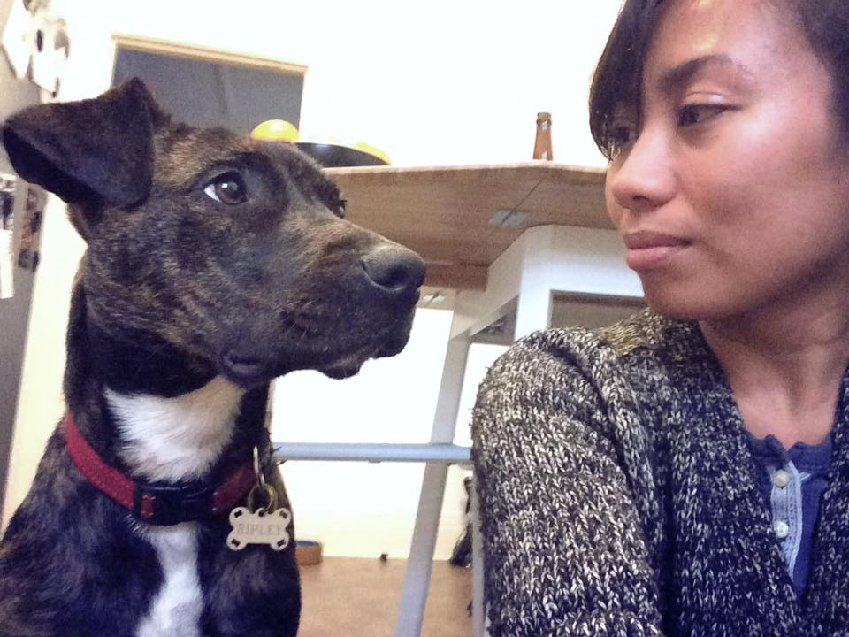

She had a keen eye and ear for human behaviour and language that saw us cycling through a _long_ list of synonyms for the word "walk" over her lifetime (to prevent undue excitement and intense puppydog-eyes). Her best trick was to methodically (for a dog) search the house for a hiding human on request, and to this day I have no idea how she learned it.

Above all, she had a heart that seemed to be bigger than she was, and wherever we were was always where she wanted to be. She had no greater love in life than curling up in bed with us in the morning (after _scrupulously_ waiting for permission, always; again, we barely had to teach her.) I'm sad that more people didn't get to see Ripley's quieter side during her healthy years, but the arrival of any new or rarely-seen human was, as far as I can tell, the most exciting thing to ever happen to her. Every time. Belly-rubs from new human-friends were her heroin.
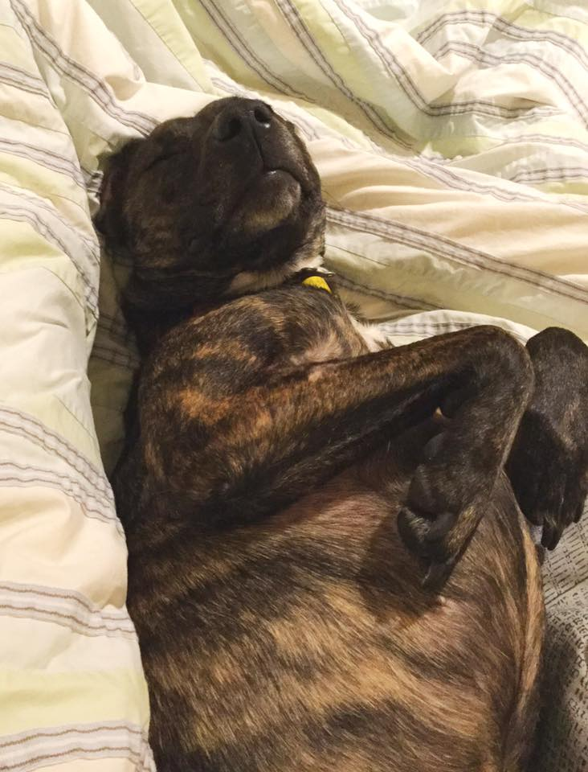

Almost everything she did, she did with _maximum enthusiasm_. She got much better at walking on the leash, but the roughly 2 meters of freedom it allowed just weren't enough for her to let off energy; the first 100 meters of any walk were covered with a ridiculous bouncing gait designed to express the maximum possible energy with every step. 
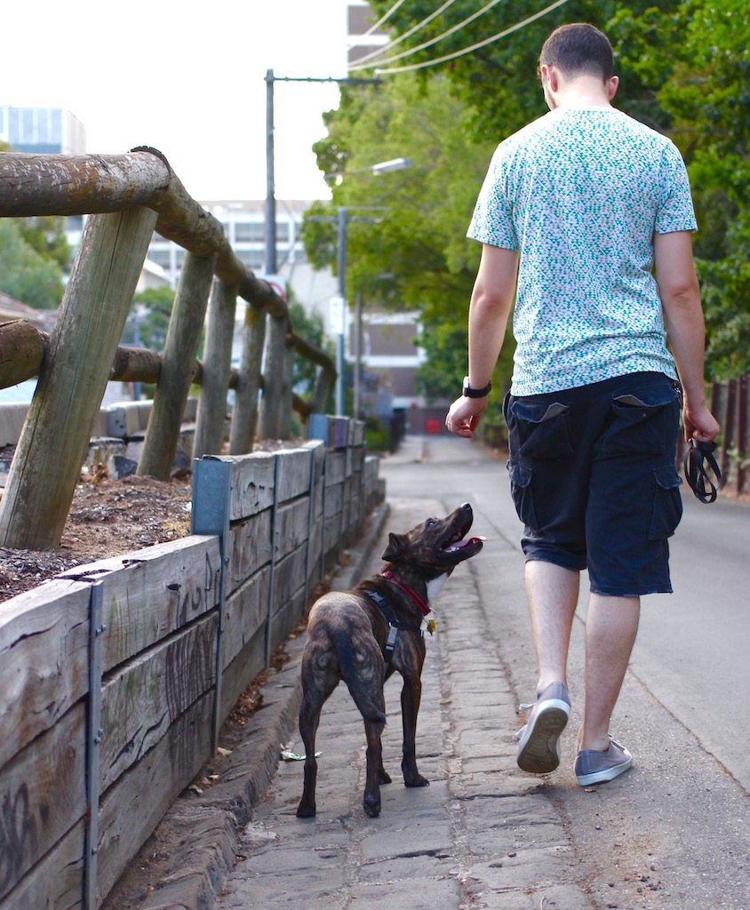

It's not surprising, then, that a drop in energy was our first red flag that something wasn't right. In late 2018, we took Ripley to the vet based on a feeling, without being able to clearly point to what was wrong; on that visit they found nothing. A month later, we took her back, having found what we thought _might_ be a lump in her neck, and we were right.
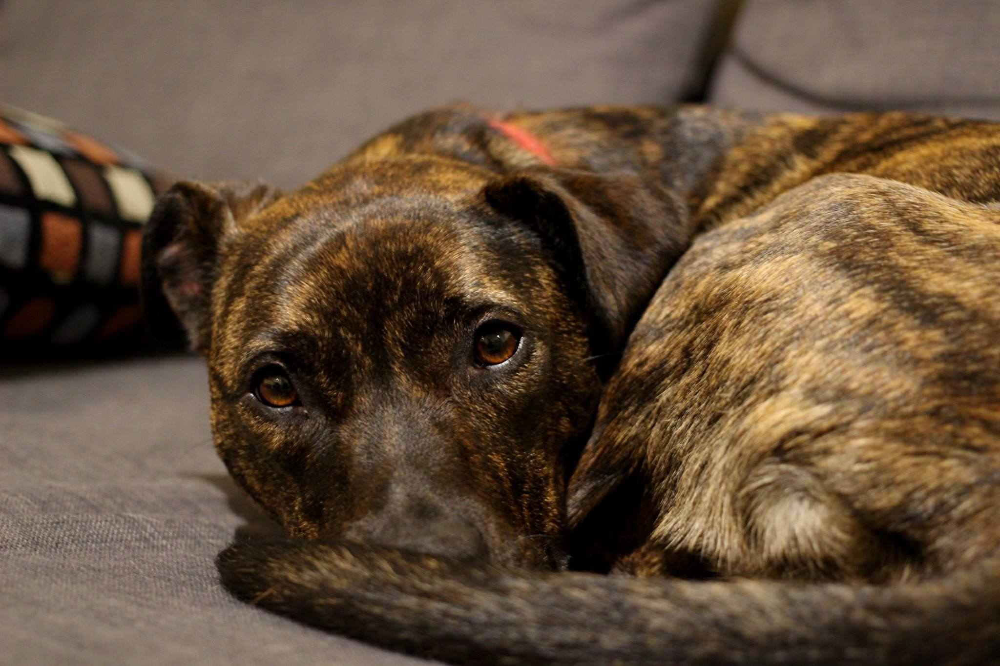

Ripley's cancer seems to have been as rare a beast as she was. We've been told that it was almost unheard-of in her breed, at her age, and in the location where it showed up; it "didn't play by any of the rules", according to one vet oncologist. More vet pathologists have furiously debated the designation of Ripley's primary tumour than the count of doctors who've seen me in my _entire life_, or at least it feels that way. They finally settled on "hemangiosarcoma", which has a median survival time of 3-6 months, and a 1-year survival rate of about 10%.
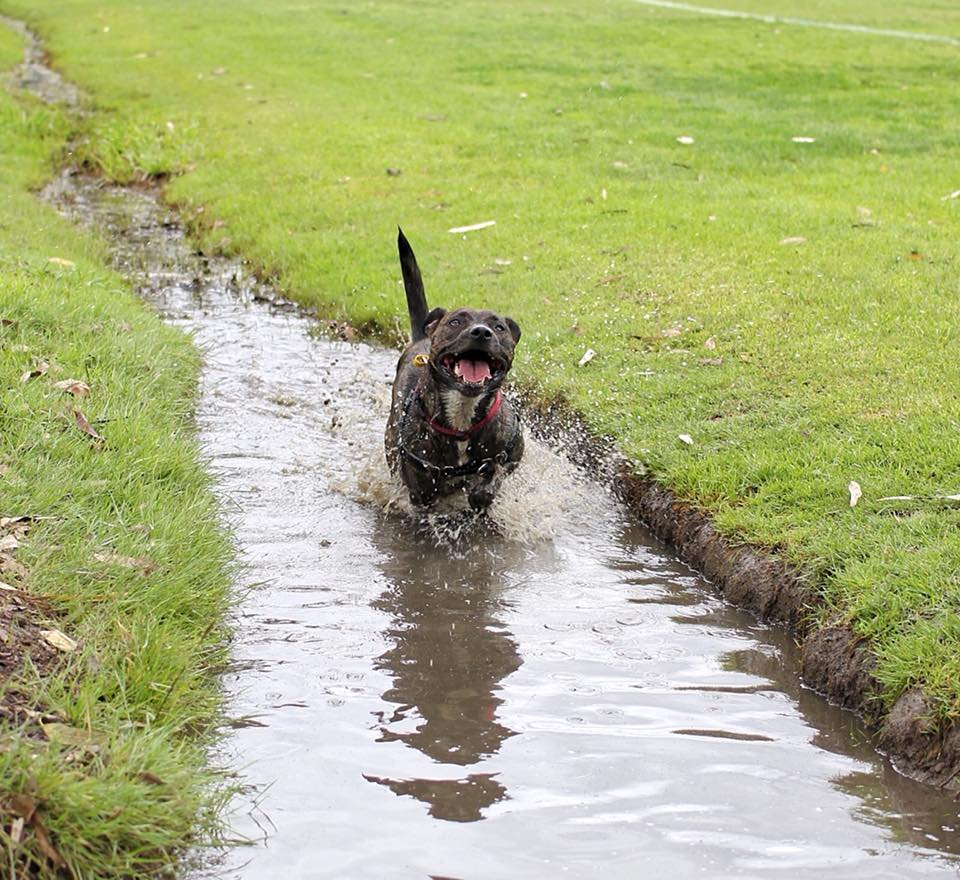

With surgery and follow-up chemotherapy, Ripley beat cancer for about 13 months. If the old "1 human year = 7 dog years" maths works, she got almost an extra relative decade with us. I hold onto that thought, because it suggests that the treatment, heartache, and expense (pet insurance covered most of it, or we wouldn't have been able to) of the past year hasn't been in vain.

She bounced back quickly from the surgery, and had blessedly short-lived and moderate side effects from the chemo. I can't thank her vets and her surgeon enough. We've been universally floored by the kindness, sensitivity, and patience of the veterinary professionals that we've dealt with. When she finished her chemo in July of last year, everything looked clear. By the end of October, it became clear that it wasn't, and that she probably had metastases in her lungs and liver, growing fast.
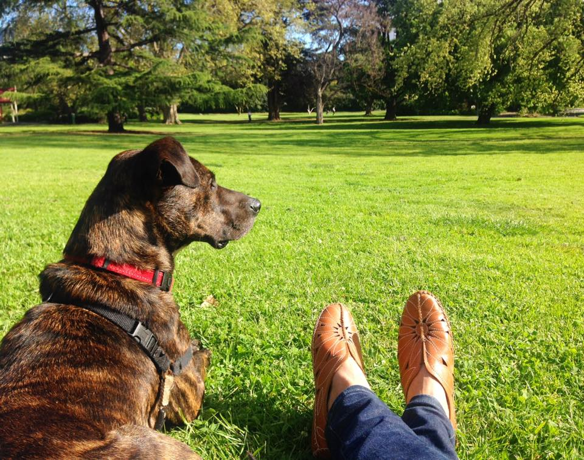

The time since then is painful to think about too much, and it was equal parts blessed and painful to live through (it's a kindness of text as a medium that I can pretend to be able to hang onto composure as I write this, and you can pretend to believe me.) We kept treating Ripley for as long as she seemed able to keep enjoying life. She had some good periods when she seemed about 70-80% of her old self; if you didn't know her, you might not have known she was ill, but the loss of her muscle mass and her energy were horribly obvious to us, and heart-rending to watch. It never occurred to me that a dog needs reasonable core strength to hold themselves in a "sit" position on a hardwood floor, until I saw Ripley start to struggle to maintain it for more than a few seconds. 
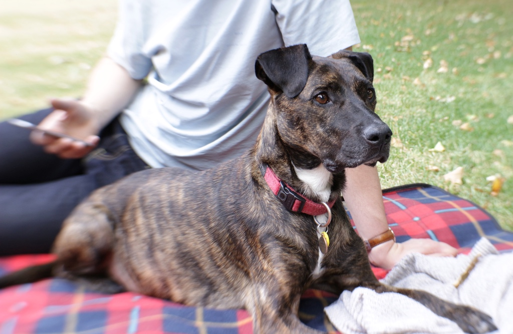

On her last weekend, a week ago, we drove her back to Hawthorn, gave her a little walk around Central Gardens, her familiar stomping grounds. Raya and I had burritos while the 3 of us sat on a picnic blanket and watched people in the park. I'm so happy that we did that; in spite of her lethargy, for a little while she seemed almost as bright and happy as ever. It's where we plan to sneakily scatter her ashes once we have them. We drove up the street to the point on our old walking route where two absurdly lovely and relaxed old labradors can stick their heads through a gap in their fence, and watched Ripley try and fit her whole body through the gap to say hi to them, as she always had.
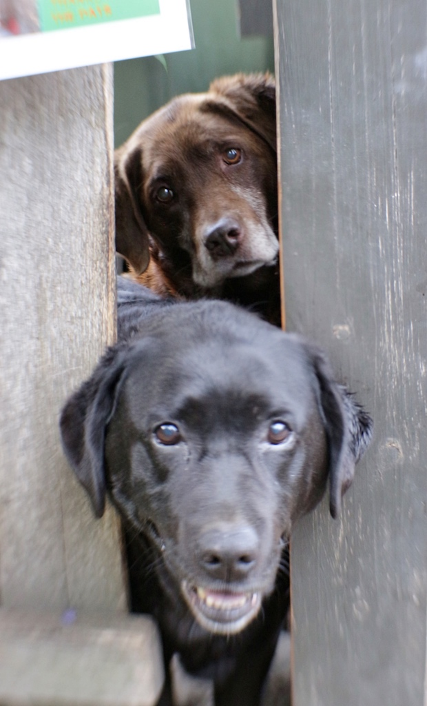

On the morning of New Year's Eve, it was clear that something was very not right. Ripley would barely stand or move, let alone eat. We took her to the animal hospital, and they explained to us that she almost certainly had an internal bleed, and that while they could put her on fluids and do an ultrasound, there was nothing they thought they could do that would be good for her. We've heard people say that it's incredibly hard to have a beloved pet euthanised. I understand what they mean, but we found the decision itself, to say goodbye to her then, an easy one.
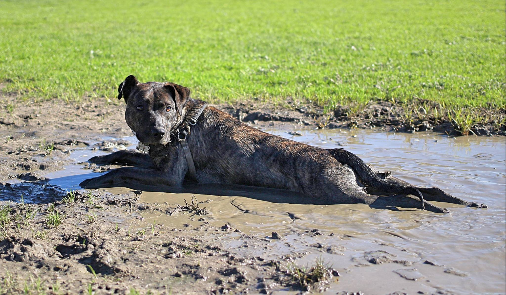

Ripley passed away around lunchtime, at Lort Smith animal hospital in North Melbourne, with both of us beside her and speaking to her, her eyes on mine. 

For most of her life, Ripley's entry or departure in a room was accompanied by a furious drumming of dog feet on a hardwood floor, sometimes a dramatic leap or a loud triumphant bark. When she left us, it was peacefully and without a whisper, as if she were tip-toeing out, so quietly that we barely knew she had gone.
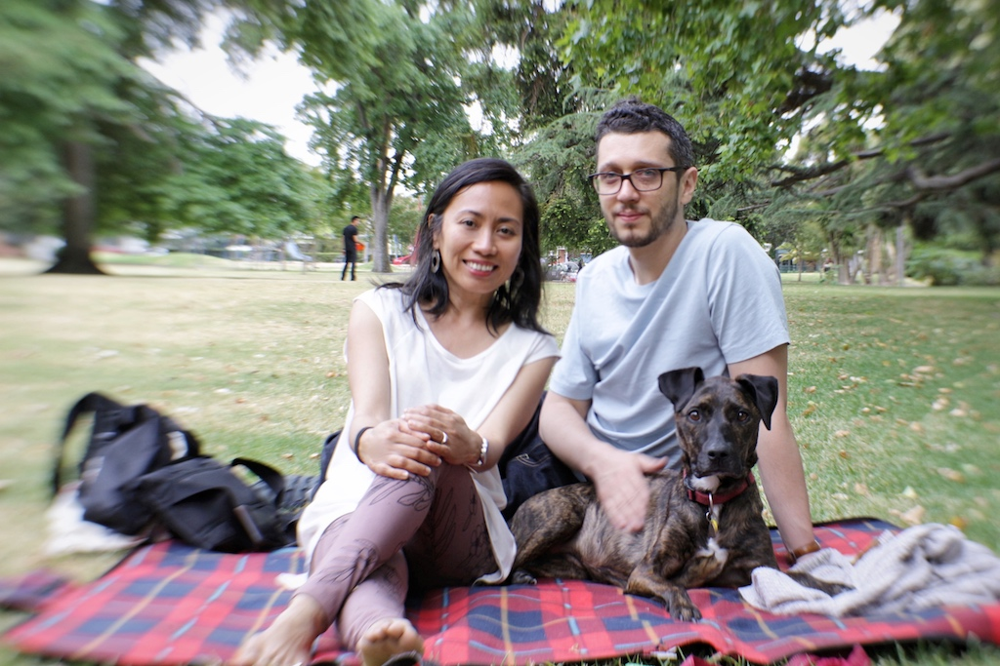

Much as I might try, I can't sum up 5 excellent years with Ripley, even in a long and maudlin post like this one. I can only say: she was a beautiful dog in almost every way, and she meant everything to us that a dog can, and her memory will be part of our lives forever. 

There's that old chestnut about pets resembling their owners, or vice versa (I'm never sure which way around that goes.) If that's true, and it makes Raya and I a pair of awkward, over-emotional skinny weirdos, prone to nerves and attention deficit, I know that it puts us in the absolute best company imaginable ❤️

_Farewell, Little Dog. You are missed._
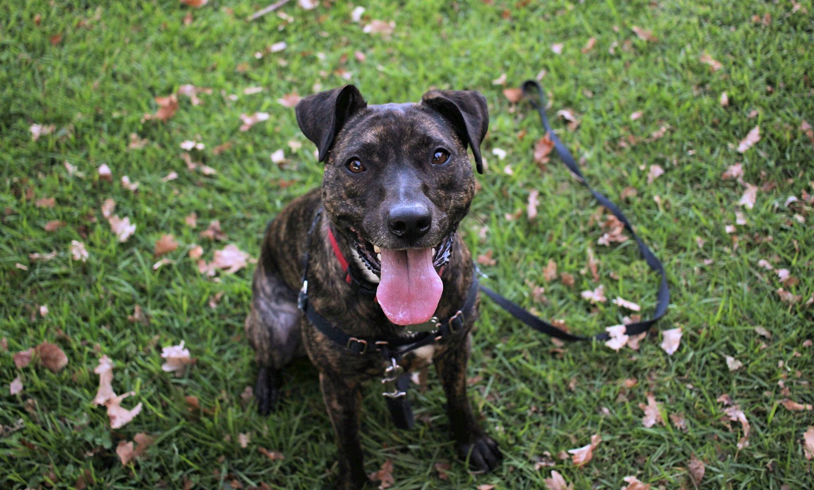
